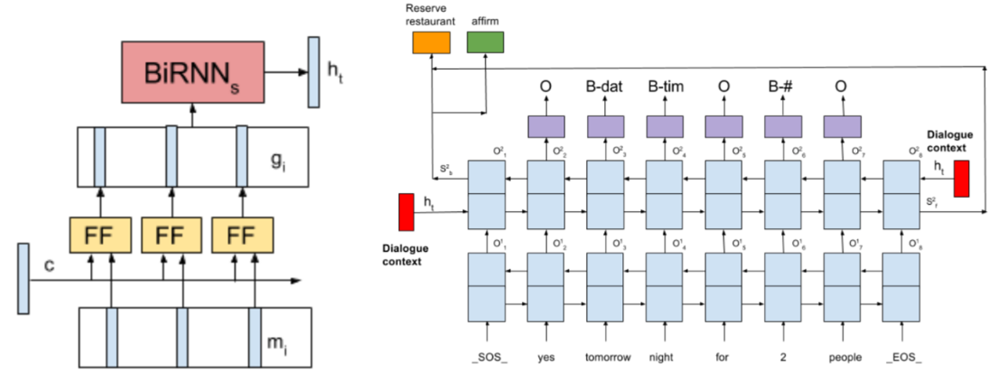

# SDEN-Pytorch

Pytorch implementation of [Sequential Dialogue Context Modeling for Spoken Language
Understanding](https://arxiv.org/pdf/1705.03455.pdf)




## Requirements

```
pytorch==0.4
nltk==3.5.1
sklearn_crfsuite
```

## Run

```
python3 main.py
```

## Data

I have modified [Stanford Multi-turn dataset](https://nlp.stanford.edu/blog/a-new-multi-turn-multi-domain-task-oriented-dialogue-dataset/) to fit this model. *So it has some noise especially slot tags.*
It consists of three domain, `Weather`, `Schedule`, `Navigate`. I did dialogue recombination for multi-domain dialogue and modified its format to BIO.

### sample

#### Single domain dialogue

```
User :  Will it be hot in Inglewood over the next few days?
BOT  :  It will be warm both Monday and Tuesday in Inglewood.
User :  Thank you very much.
BOT  :  You're welcome. Hope you have a great day.
```

#### Multi domain dialogue

```
User :  is it going to be raining this weekend
BOT  :  What city are you inquiring about?
User :  Alhambra please.
BOT  :  It will be raining on Saturday and hailing on Sunday in Alhambra.
User :  Thanks.
BOT  :  happy to help
User :  I need a gas station
BOT  :  I have one gas station listed. Want more info?
User :  What is the address?
BOT  :  76 is at 91 El Camino Real.
User :  Thank you!
BOT  :  You're welcome, stay safe.
```


## Devset Result

`Intent Detection : 0.9503091367071216 (Accuracy)`


`Slot Extraction`

|                     | precision| recall | f1-score | support |
|---------------------|----------|--------|----------|---------|
| B-agenda            |0.256     |0.278   |0.267     |36       | 
| I-agenda            |0.733     |0.407   |0.524     |54       |
| B-date              |0.826     |0.836   |0.831     |911      |
| I-date              |0.533     |0.885   |0.665     |549      |
| B-distance          |0.624     |0.674   |0.648     |487      |
| I-distance          |0.424     |0.353   |0.386     |167      |
| B-event             |0.813     |0.793   |0.803     |517      |
| I-event             |0.637     |0.847   |0.727     |367      |
| B-location          |0.718     |0.928   |0.809     |572      |
| I-location          |0.384     |0.950   |0.547     |280      |
| B-party             |0.298     |0.807   |0.435     |187      |
| I-party             |0.471     |0.471   |0.471     |17       |
| B-poi_type          |0.790     |0.738   |0.763     |534      |
| I-poi_type          |0.528     |0.718   |0.608     |301      |
| B-room              |1.000     |0.400   |0.571     |35       |
| I-room              |0.683     |0.848   |0.757     |33       |
| B-time              |0.496     |0.595   |0.541     |220      |
| I-time              |0.129     |0.286   |0.178     |14       |
| B-traffic_info      |0.661     |0.527   |0.587     |237      |
| I-traffic_info      |0.749     |0.636   |0.688     |272      |
| B-weather_attribute |0.904     |0.877   |0.890     |546      |
| I-weather_attribute |0.954     |0.775   |0.855     |80       |
| avg / total         |0.683     |0.775   |0.712     |6416     |
